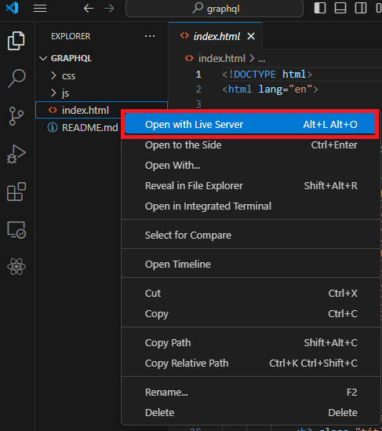

# 📈 GraphQL 📊 

This project aims to develop a personal profile page using the GraphQL query language. The profile page will fetch and display user-specific data from a GraphQL API endpoint provided by 01.kood.tech. 

# Features

### Login Page
- A login page that supports authentication using either `username:password` or `email:password`.
- The credentials will be used to obtain a JWT from the signin endpoint `https://01.kood.tech/api/auth/signin`
- The JWT will be used for authorization in subsequent GraphQL queries.
- If login fails, an appropriate error message will be displayed.
- A logout function to invalidate the current session.

### Profile Page

- The profile page will display user-specific information retrieved from the GraphQL API.
- User Information: Basic identification information
- XP Stats: Display the total XP earned by the user.
- Progress: Show a summary of the user's progress on various projects and exercises.
- The profile page will be visually appealing and user-friendly, adhering to UI/UX principles.

### Statistics Section

- Graph 1: XP Over Time: An SVG graph showing the XP earned by the user over a specific time period.
- Graph 2: Projects PASS/FAIL Ratio: An SVG graph visualizing the ratio of passed and failed projects.
- Graph 3: Top 5 skills that have aquired

### Built with
* [![CSS][CssBadge]][Css-url]
* ![HTML][HtmlBadge]
* ![Javascript][Javascript]

[CssBadge]: https://img.shields.io/badge/CSS3-1572B6?style=for-the-badge&logo=css3&logoColor=white
[Css-url]: https://developer.mozilla.org/en-US/docs/Learn/CSS/CSS_layout/Introduction
[HtmlBadge]: https://img.shields.io/badge/HTML5-E34F26?style=for-the-badge&logo=html5&logoColor=white
[Javascript]: https://img.shields.io/badge/JavaScript-F7DF1E?style=for-the-badge&logo=javascript&logoColor=black
## Usage

**Run the Program**  

*To Audit GraphQl:*
**Run the Program**  
- With extension  

- Without extension
* making here github page*

## Contributing
Contributions are welcome! 
If you find any bugs or have suggestions for improvements, please feel free to contact us on discord `orduruutel` | `Kirsika🍒` | `ragnarlauga`  

